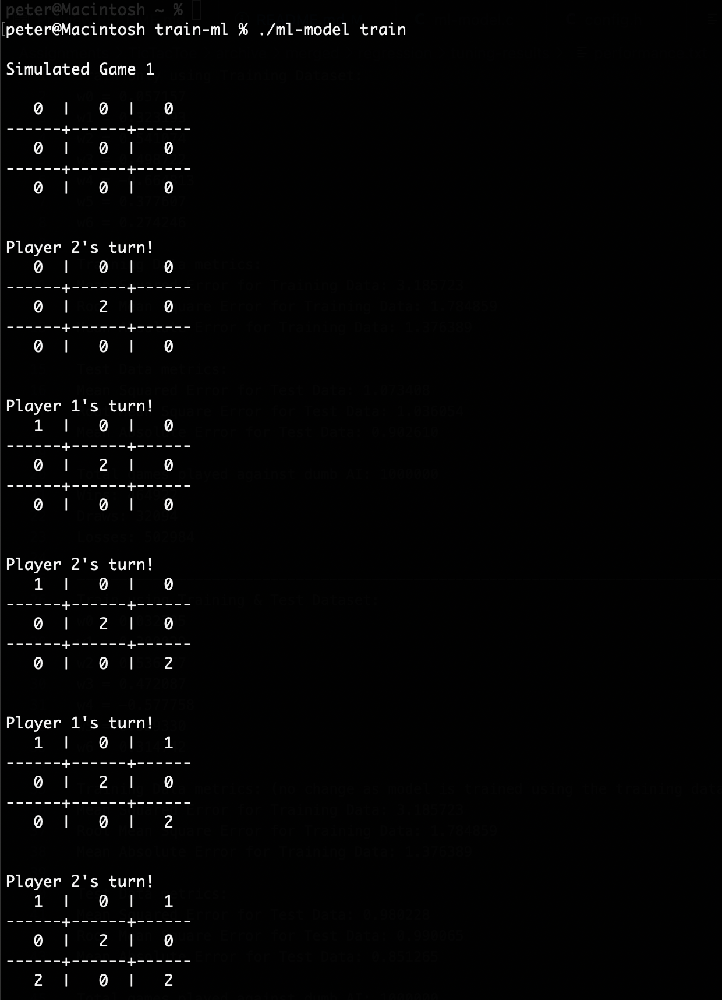
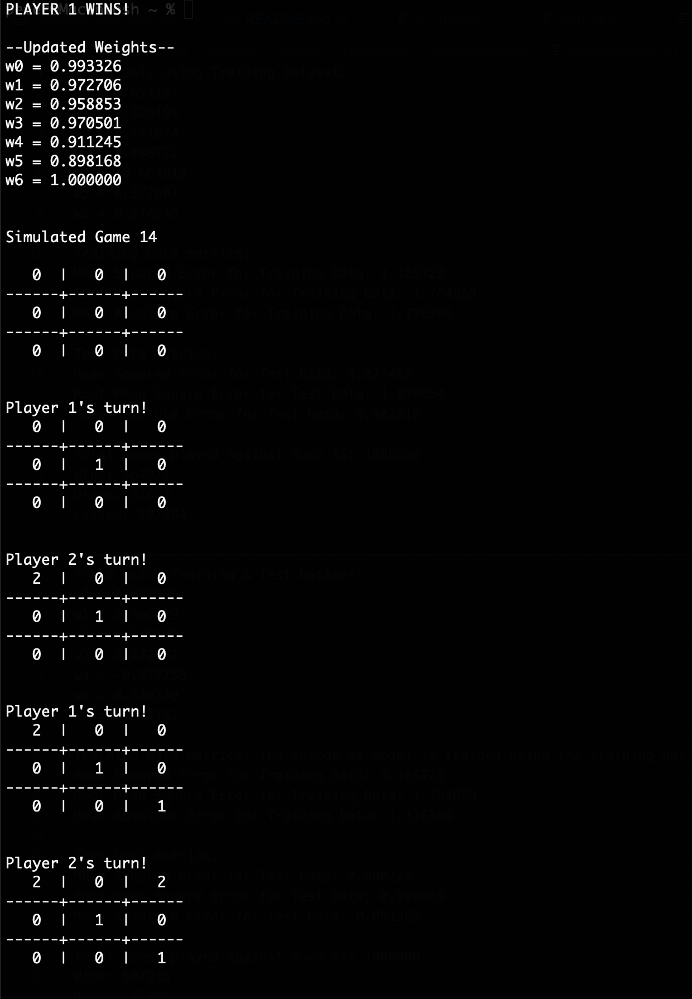
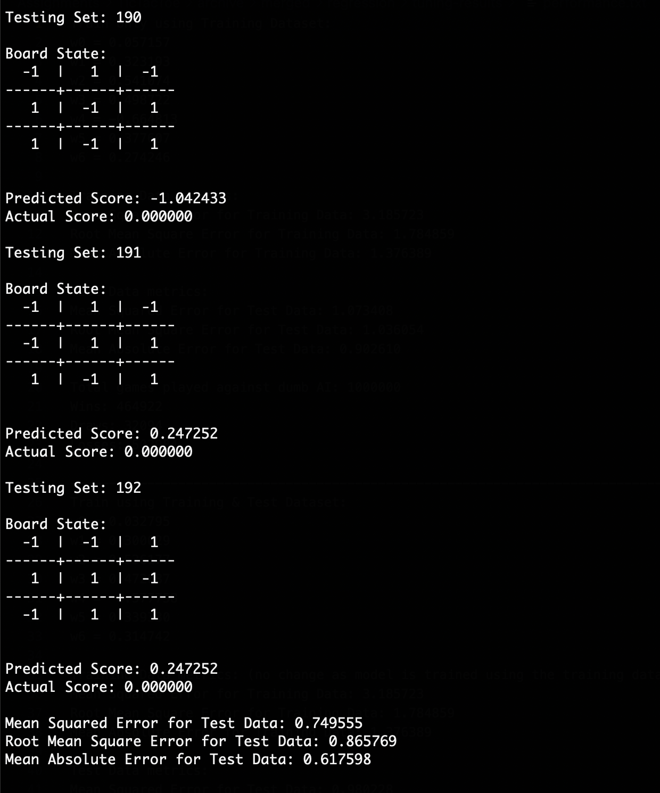
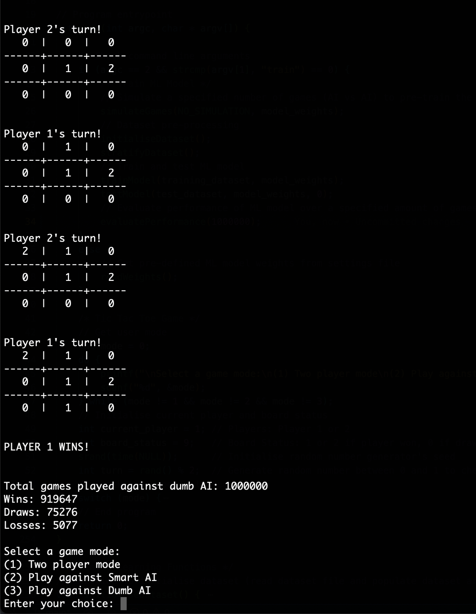

## Multi-Linear Regression Model Training 
List of Contents
- [Brief Overview](#brief-overview)
- [Model Training](#model-training)
- [Model Performance](#model-performance)
- [Results](#results)
- [Program Files](#program-files)
- [Program Usage](#program-usage)
### Brief Overview
---
This supplementary program trains the Multi-Linear Regression model that will be used in the main Tic Tac Toe game program. Apart from just training the regression model, this program also includes game playing functionalities for the user to play a game against the model. To learn more about how the move selection algorithm works and more details on the machine learning algorithm used, please refer to the report or view the source code directly.
### Model Training
---
The multi-linear regression model is trained in two stages:
1. Training through simulated games against itself (10,000 games)
2. Training using training dataset provided (University of California Irvine)
### Model Performance
---
This program measures the performance of the regression model on the training and test datasets, using the following metrics:
- Mean Squared Error
  - Refers to the average squared difference between the actual and estimated scores
- Root Mean Square Error
  - Refers to the square root of the computed mean squared error
- Mean Absolute Error
  - Refers to the mean of the absolute values of the individual estimated score errors
- Game results against simulated random computer player (1,000,000 games)
  - Computes the total number of wins, draws, and losses by the regression model against an emulated computer player that makes a random move for each turn
### Results
---
After training and optimising the model, the following set of optimal weights are derived:
```
w0 = -0.537699
w1 = -0.025055
w2 = -0.292842
w3 = 1.289685
w4 = -0.252367
w5 = -0.221150
w6 = 1.003676
``` 
The results for the trained model are as follows:
```
Training Data metrics:
Mean Squared Error for Training Data: 0.861692
Root Mean Square Error for Training Data: 0.928274
Mean Absolute Error for Training Data: 0.776785

Test Data metrics:
Mean Squared Error for Test Data: 0.749555
Root Mean Square Error for Test Data: 0.865769
Mean Absolute Error for Test Data: 0.617598

Total games played against dumb AI: 1000000
Wins: 899703
Draws: 34559
Losses: 65738
```
### Program Files
---
```
README.md (this file)

docs/ (contains images)

dataset/ (contains dataset)

config.h (configuration file)

ml-model.c (main program)

weights.txt (contains optimal model weights)

run.sh (script for running program)
```
### Program Usage
---
1. Download source code (no external libraries are required).
2. Compile the program.<br>
    `gcc -o ml-model ml-model.c`<br><br>
3. Run the program!<br>
  - For normal usage (play against trained model), no additional command line arguments are required <br>
    `./ml-model` <br><br>
  - To train the model, ensure that the 'train' or 'train-all' command line argument is added. <br>
    `./ml-model train` <br><br>
    `./ml-model train-all` <br><br>
    *\*By default, the first option will not run simulated games against a random computer player to evaluate the model's performance, as it may take a while to run 1,000,000 games!*
<br><br>
Alternatively, you can compile and run the program simply by running the *run.sh* script!
1. Add executable permissions for the script. <br>
  `chmod +x run.sh`
2. Run the script!<br>
  `./run.sh`

### Sample program execution previews
---
Normal Usage<br>

<br>Model Training (Simulated Games & Training Dataset)<br>




