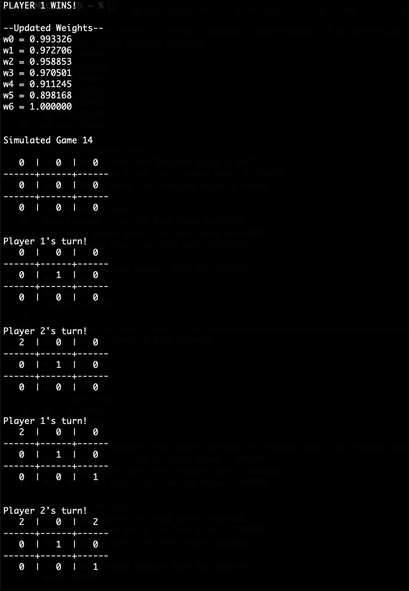
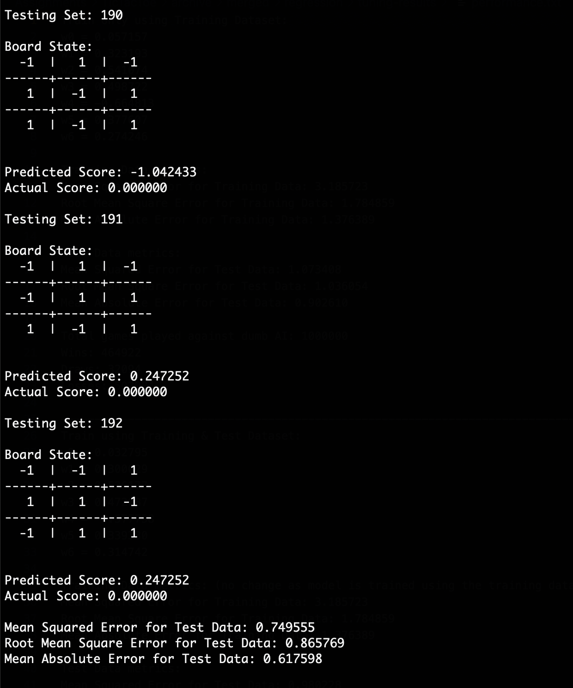

## Multi-Linear Regression Model Training 
### Brief Overview
---
This supplementary program trains the Multi-Linear Regression model that will be used in the main Tic Tac Toe game program. Apart from just training the regression model, this program also includes game playing functionalities for the user to play a game against the model. To learn more about how the move selection algorithm works and more details on the machine learning algorithm used, please refer to the report or view the source code directly.
### Model Training
---
The multi-linear regression model is trained in two stages:
1. Training through simulated games against itself (10,000 games)
2. Training using training dataset provided (University of California Irvine)
### Model Performance
---
This program measures the performance of the regression model on the training and test datasets, using the following metrics:
- Mean Squared Error
  - Refers to the average squared difference between the actual and estimated scores
- Root Mean Square Error
  - Refers to the square root of the computed mean squared error
- Mean Absolute Error
  - Refers to the mean of the absolute values of the individual estimated score errors
- Game results against simulated random computer player (1,000,000 games)
  - Computes the total number of wins, draws, and losses by the regression model against an emulated computer player that makes a random move for each turn

### Program Usage
---
1. Download source code (no external libraries are required).
2. Compile the program. 
    `gcc -o ml-model ml-model.c`  
3. Run the program! 
  - For normal usage (play against trained model), no additional command line arguments are required  
    `./ml-model`   
  - To train the models, ensure that the 'train' command line argument is added.  
    `./ml-model train `   
    *\*By default, the code for running the simulated games against a random computer player to evaluate the model's performance is commented out, as it may take a while to run 1,000,000 games!*

#### Sample program execution previews
---
Normal Usage 

 Model Training (Simulated Games & Training Dataset) 

